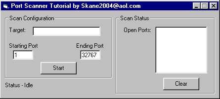



## Port Scanner Tutorial

### Description

This code is a tutorial on how to make a port scanner. This scanner is not meant to be quick, but it is meant to teach (it has a comment on about every line describing what the code is doing), and it also includes other examples like loading controls (making control arrays), centering forms on your own and why it works, global variables, and more.
 
### More Info
 
It's best to use on yourself if you want to use it. But the purpose of the code is to teach, not to be used as a practical scanner.

Be aware when you're scanning people, some ports are known for trojan viruses. Some ISPs frown upon people scanning others on ports known for those trojans. Port scanners are meant to scan yourself, not others, and make sure you aren't vulnerable to attack.

             |
---                |---
**Submitted On**   |2001-07-07 17:41:36
**By**             |[Sean Kane](https://github.com/Planet-Source-Code/PSCIndex/blob/master/ByAuthor/sean-kane.md)
**Level**          |Advanced
**User Rating**    |4.3 (17 globes from 4 users)
**Compatibility**  |VB 4\.0 \(32\-bit\), VB 5\.0, VB 6\.0
**Category**       |[Internet/ HTML](https://github.com/Planet-Source-Code/PSCIndex/blob/master/ByCategory/internet-html__1-34.md)
**World**          |[Visual Basic](https://github.com/Planet-Source-Code/PSCIndex/blob/master/ByWorld/visual-basic.md)
**Archive File**   |[Port Scann22384772001\.zip](https://github.com/Planet-Source-Code/sean-kane-port-scanner-tutorial__1-24817/archive/master.zip)

